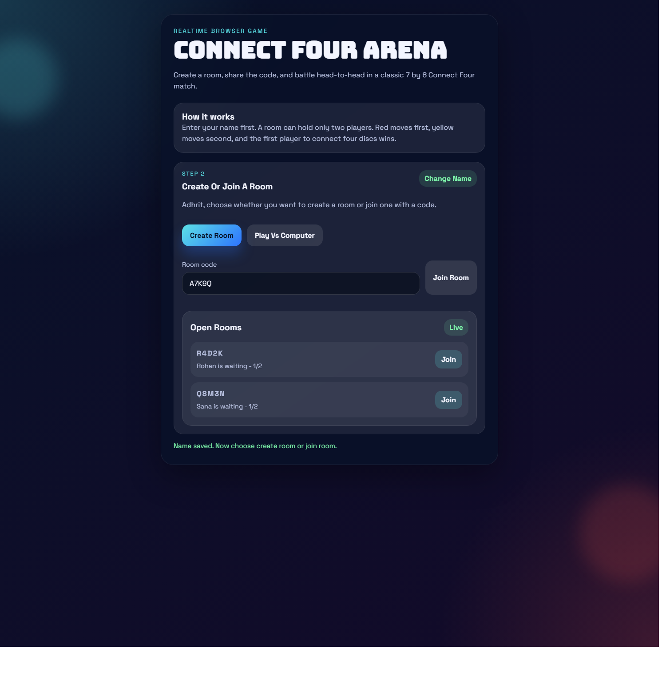
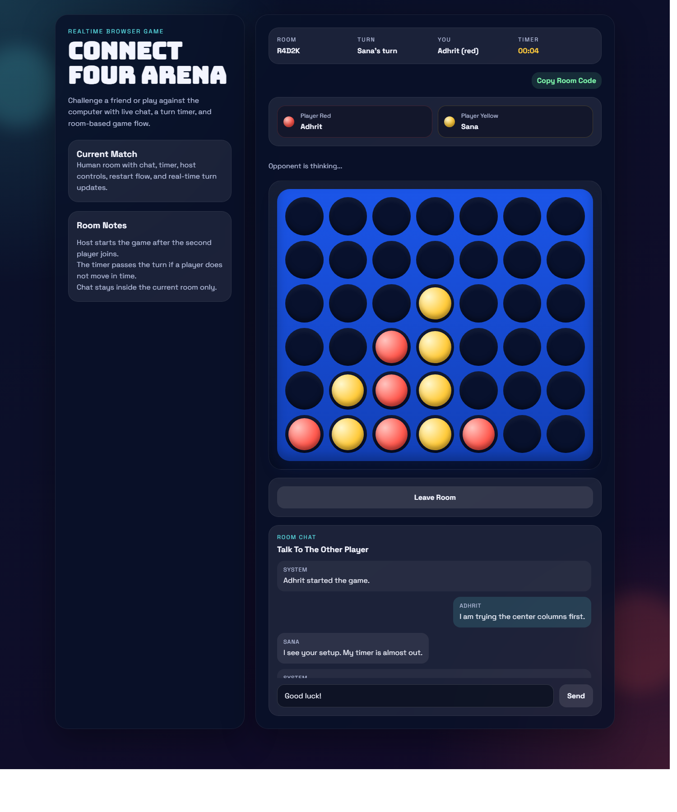

# Connect Four Arena

Connect Four Arena is a browser-based multiplayer Connect Four game built with `Node.js`, `Express`, and `Socket.IO`.

It supports:

- Human vs human rooms
- Human vs computer matches
- Room chat
- Copy room code for shared rooms
- Host-only game start for human rooms
- Turn timer with automatic turn pass when time runs out
- Restart button after a win or draw

## Screenshots

### Lobby



### Gameplay



## How To Run The Game

### Requirements

- `Node.js` installed

### Install dependencies

If dependencies are not installed yet, run:

```powershell
npm install
```

If PowerShell blocks `npm`, use:

```powershell
npm.cmd install
```

### Start the server

```powershell
npm start
```

If PowerShell blocks `npm`, use:

```powershell
npm.cmd start
```

You can also run the server directly:

```powershell
node server.js
```

### Open the game

After starting the server, open this in your browser:

```text
http://localhost:3000
```

## How To Play

### Human vs human

1. Enter your name.
2. Click `Create Room` to make a room, or enter a room code and click `Join Room`.
3. When two players are in the room, the host must click `Start Game`.
4. Red plays first, then yellow.
5. Click a column to drop your disc.
6. Connect 4 discs in a row to win.

### Human vs computer

1. Enter your name.
2. Click `Play Vs Computer`.
3. The game starts automatically.
4. You play as red and the computer plays as yellow.

## How The Game Works

### Board rules

- The board has `7 columns` and `6 rows`.
- A disc always falls to the lowest empty space in a column.
- A player wins by connecting `4` of their own discs:
  - horizontally
  - vertically
  - diagonally
- If the board fills completely and nobody connects four, the round is a draw.

### Lobby flow

- The player must enter a name first.
- For human matches, one player creates a room and the other joins with the room code.
- A human room can only hold `2 players`.
- Once both players are inside, only the host can start the game.

### Turn timer

- Each turn has a `20 second` timer.
- If the current player does not move before the timer reaches zero, the turn is passed to the other player automatically.
- In computer mode, if your timer runs out, the turn passes to the computer.

### Restart flow

- After a player wins, or after a draw, a restart button appears.
- Clicking it starts a fresh round on the same board setup.

### Chat

- Each room has its own chat panel.
- Messages are only visible inside the current room.
- System messages also appear in chat for events like room creation, player join, and game start.

### Copy room code

- In human rooms, the `Copy Room Code` button copies the room code so you can share it easily.
- In computer rooms, that button is disabled because those rooms are private to one player.

## Project Files

- `server.js`: backend game server and room logic
- `public/index.html`: page structure
- `public/styles.css`: styling
- `public/app.js`: frontend game logic and UI behavior

## Notes

- Human rooms are real-time and update across browser tabs or devices on the same server.
- The computer uses a simple strategy: it tries to win, block your win, and prefer strong center columns.
